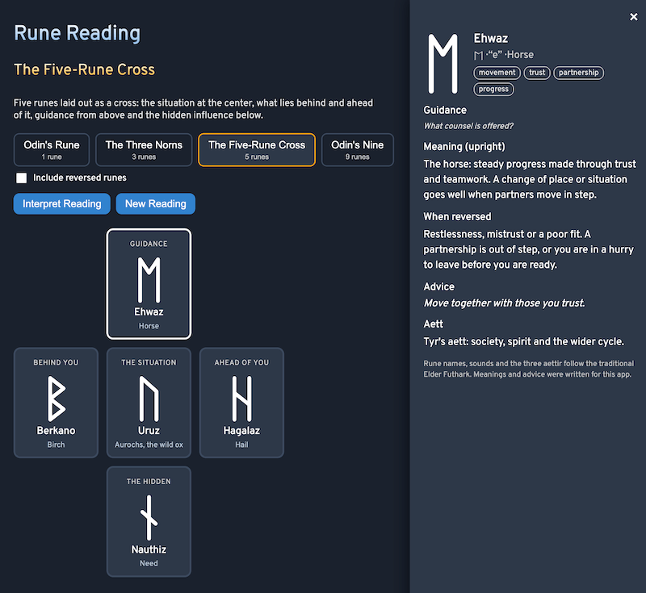

# Rune-Reading

Draw a rune reading with the Elder Futhark, right in your browser. Pick a spread, draw runes from the bag, and read what each one says about its place in the layout. No sign-up, no libraries, no images.

- [Draw a rune reading](https://evoluteur.github.io/rune-reading/)
- [About runes](https://evoluteur.github.io/rune-reading/about.html)
- [The 24 runes](https://evoluteur.github.io/rune-reading/runes/index.html): one page per rune, with its meaning, reversed meaning and history



## What it does

Choose one of four spreads, then draw the runes one at a time from the bag (or all at once). Each rune lands face up in its position, and you can click it for its meaning, advice and family. "Interpret Reading" lays the whole reading out as a story, position by position.

- **Odin's Rune** (1 rune): a quick answer, or a theme for the day.
- **The Three Norns** (3 runes): Past (Urd), Present (Verdandi) and Future (Skuld), named for the three Norns who tend the well of fate.
- **The Five-Rune Cross** (5 runes): the situation at the center, what lies behind and ahead of it, guidance from above and the hidden influence below.
- **Odin's Nine** (9 runes): three rows of three for the past, the present and the future, from the root of the matter to the likely outcome.

Runes are drawn without replacement, so a rune never appears twice in one reading.

## Hear the runes

Each rune on the board has a small speaker icon: click it to hear the name of the rune spoken aloud (Fehu, Uruz, Thurisaz...). It uses your browser's built-in speech voice, so there are no audio files to download and the voice depends on your device. Browsers without speech support simply do not show the icon.

## Reversed runes

Some traditions read only upright runes, so reversals are optional: tick **Include reversed runes** and each rune that can be reversed has an even chance of landing upside down. A reversed rune is shown turned over, marked in orange, and read for the shadow side of its meaning: a block, a delay or a lesson still to learn.

Nine of the 24 runes (Gebo, Hagalaz, Nauthiz, Isa, Jera, Eihwaz, Sowilo, Ingwaz and Dagaz) look the same upside down, so they have no reversed meaning and always fall upright.

## The runes

The 24 runes of the Elder Futhark, the oldest runic alphabet, are listed in their traditional order and divided into three families of eight called *aettir*:

- **Freyr's aett**: Fehu, Uruz, Thurisaz, Ansuz, Raidho, Kaunan, Gebo, Wunjo
- **Heimdall's aett**: Hagalaz, Nauthiz, Isa, Jera, Eihwaz, Perthro, Algiz, Sowilo
- **Tyr's aett**: Tiwaz, Berkano, Ehwaz, Mannaz, Laguz, Ingwaz, Dagaz, Othala

Each rune has its name (which you can hear), the sound it stands for (f, u, th, a, r...), literal meaning, keywords, an upright meaning, a reversed meaning where it has one, and a line of advice. The names, sounds and aettir are the traditional ones. The meanings and advice were written for this app, in the spirit of the tradition. Runes are an old tool for reflection, not a verdict: treat a reading as a mirror for your own judgment.

## Rune pages

Every rune also has its own static page (`runes/fehu.html` ... `runes/othala.html`), plus a page listing all 24 (`runes/index.html`), so each rune can be found, shared and indexed on its own. They are generated from the same data as the app:

```
npm run build
```

This runs [scripts/build-rune-pages.js](https://github.com/evoluteur/rune-reading/blob/main/scripts/build-rune-pages.js), which reads [js/runes-data.js](https://github.com/evoluteur/rune-reading/blob/main/js/runes-data.js) and the longer texts (origin of the name, how the rune reads in a spread) in [scripts/rune-extra.js](https://github.com/evoluteur/rune-reading/blob/main/scripts/rune-extra.js), and rewrites the pages, `sitemap.xml` and `robots.txt`. It only needs Node. Re-run it after editing either file and commit the result.

## How it is built

The app itself is plain HTML, CSS and JavaScript, with no dependencies and no build step. Just open `index.html`. (The only build step is the optional one above that regenerates the static rune pages.)

- The rune glyphs are drawn as SVG strokes, so they look the same everywhere and do not depend on the visitor's fonts having a Runic character set. A reversed rune is the same drawing turned half a turn.
- The spoken names come from the browser's speech synthesis. Each name is respelled the way it is pronounced (for example "Fayhoo" for Fehu) in the `SAY` list at the top of [js/speech.js](https://github.com/evoluteur/rune-reading/blob/main/js/speech.js), so a name that sounds wrong on your device is a one-line fix.
- All the rune and spread data lives in [js/runes-data.js](https://github.com/evoluteur/rune-reading/blob/main/js/runes-data.js). To add a spread, add an entry to `SPREADS` with its positions on a grid.
- Three color themes (dark, light and blue) are shared with my other projects (copied from [omg-themes](https://github.com/evoluteur/omg-themes)), and the theme, the current spread and your last reading are remembered in the browser's local storage.

Rune-Reading is open source at [GitHub](https://github.com/evoluteur/rune-reading) with MIT license.

Had fun browsing the app? [Buy me a coffee by becoming a sponsor](https://github.com/sponsors/evoluteur).

You may also be interested in my other divination project [Motivational-Numerology](https://github.com/evoluteur/motivational-numerology) ([demo](https://evoluteur.github.io/motivational-numerology/)). For more mystic arts as small web apps, see [Esoterica](https://evoluteur.github.io/esoterica.html).

Copyright (c) 2026 [Olivier Giulieri](https://evoluteur.github.io/).
